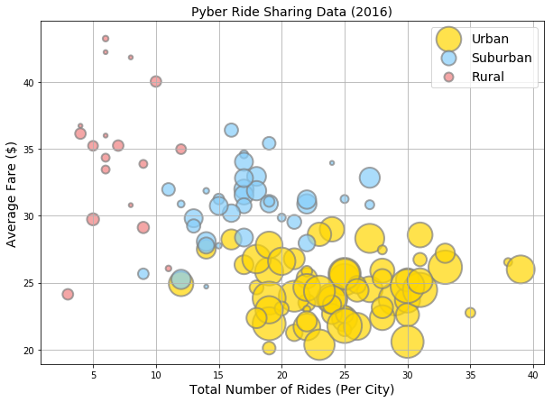
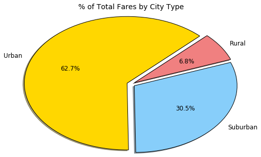
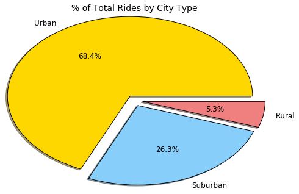
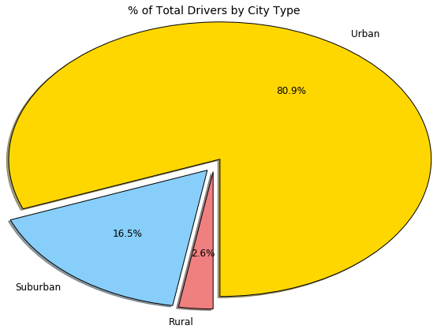

```python
# Trends
# 1) The more total rides in a city, the higher the number of drivers.
# 2) The more drivers, the lower the average fare per ride.
# 3) There is a negative correlation between the total number of rides in a city and the average fare per ride.
```


```python
import pandas as pd 
import numpy as np 
import matplotlib.pyplot as plt
import seaborn as sns
import matplotlib
```


```python
#Import csv files
city_data = "raw_data/city_data.csv"
ride_data = "raw_data/ride_data.csv"

city_df = pd.read_csv(city_data)
ride_df = pd.read_csv(ride_data)
```


```python
city_df.head()
```


<div>
<style scoped>
    .dataframe tbody tr th:only-of-type {
        vertical-align: middle;
    }

    .dataframe tbody tr th {
        vertical-align: top;
    }

    .dataframe thead th {
        text-align: right;
    }
</style>
<table border="1" class="dataframe">
  <thead>
    <tr style="text-align: right;">
      <th></th>
      <th>city</th>
      <th>driver_count</th>
      <th>type</th>
    </tr>
  </thead>
  <tbody>
    <tr>
      <th>0</th>
      <td>Richardfort</td>
      <td>38</td>
      <td>Urban</td>
    </tr>
    <tr>
      <th>1</th>
      <td>Williamsstad</td>
      <td>59</td>
      <td>Urban</td>
    </tr>
    <tr>
      <th>2</th>
      <td>Port Angela</td>
      <td>67</td>
      <td>Urban</td>
    </tr>
    <tr>
      <th>3</th>
      <td>Rodneyfort</td>
      <td>34</td>
      <td>Urban</td>
    </tr>
    <tr>
      <th>4</th>
      <td>West Robert</td>
      <td>39</td>
      <td>Urban</td>
    </tr>
  </tbody>
</table>
</div>


```python
ride_df.head()
```


<div>
<style scoped>
    .dataframe tbody tr th:only-of-type {
        vertical-align: middle;
    }

    .dataframe tbody tr th {
        vertical-align: top;
    }

    .dataframe thead th {
        text-align: right;
    }
</style>
<table border="1" class="dataframe">
  <thead>
    <tr style="text-align: right;">
      <th></th>
      <th>city</th>
      <th>date</th>
      <th>fare</th>
      <th>ride_id</th>
    </tr>
  </thead>
  <tbody>
    <tr>
      <th>0</th>
      <td>Lake Jonathanshire</td>
      <td>2018-01-14 10:14:22</td>
      <td>13.83</td>
      <td>5739410935873</td>
    </tr>
    <tr>
      <th>1</th>
      <td>South Michelleport</td>
      <td>2018-03-04 18:24:09</td>
      <td>30.24</td>
      <td>2343912425577</td>
    </tr>
    <tr>
      <th>2</th>
      <td>Port Samanthamouth</td>
      <td>2018-02-24 04:29:00</td>
      <td>33.44</td>
      <td>2005065760003</td>
    </tr>
    <tr>
      <th>3</th>
      <td>Rodneyfort</td>
      <td>2018-02-10 23:22:03</td>
      <td>23.44</td>
      <td>5149245426178</td>
    </tr>
    <tr>
      <th>4</th>
      <td>South Jack</td>
      <td>2018-03-06 04:28:35</td>
      <td>34.58</td>
      <td>3908451377344</td>
    </tr>
  </tbody>
</table>
</div>


```python
# Rename dataframes
ride_city = ride_df.groupby('city')
city = city_df.set_index('city')

# Average fare by city
avg_fare = ride_city['fare'].mean()

# Total rides
total_rides = ride_city['ride_id'].count()

# Number of drivers
total_drivers = city['driver_count']

# City types
city_types = city['type']
```


```python
# Building dataframe
totes_df = pd.concat([avg_fare, 
                       total_rides, 
                       total_drivers, 
                       city_types],
                     axis = 1)
totes_df = totes_df.rename(columns={'fare' : 'Average Fare ($)',
                                   'ride_id' : 'Total Number of Rides (Per City)',
                                   'driver_count' : 'driver count per city',
                                   'type' : 'City Types'})
```


```python
# Separating city types
urban_df = totes_df.loc[totes_df['City Types'] == 'Urban']
sub_df = totes_df.loc[totes_df['City Types'] == 'Suburban']
rural_df = totes_df.loc[totes_df['City Types'] == 'Rural']

# Size of bubbles based on driver population
area1 = urban_df['driver count per city'] * 20
area2 = sub_df['driver count per city'] * 20
area3 = rural_df['driver count per city'] * 20
```


```python
# City type scatter plots, by color
ax1 = urban_df.plot(kind='scatter', x='Total Number of Rides (Per City)', y='Average Fare ($)', s=area1, color='gold', edgecolor='gray', alpha=0.7, label='Urban', LineWidth = 2, figsize=(10,7))    
ax2 = sub_df.plot(kind='scatter', x='Total Number of Rides (Per City)', y='Average Fare ($)', s=area2, color='lightskyblue', edgecolor='gray', alpha=0.7, ax=ax1, label='Suburban', LineWidth = 2)    
ax3 = rural_df.plot(kind='scatter', x='Total Number of Rides (Per City)', y='Average Fare ($)', s=area3, color='lightcoral', edgecolor='gray', alpha=0.7, ax=ax1, label='Rural', LineWidth = 2)

# Plot formatting
plt.legend(fontsize=14)
plt.grid()
plt.title('Pyber Ride Sharing Data (2016)', fontsize=14)
plt.xlabel('Total Number of Rides (Per City)', fontsize=14)
plt.ylabel('Average Fare ($)', fontsize=14)
```


    Text(0,0.5,'Average Fare ($)')





```python
city_type = city_df.set_index('city')
pie_df = ride_df.join(city_type, on='city')

# Set fare sums for data
pie_urban = pie_df.loc[pie_df['type'] == 'Urban']
pie_urban = pie_urban.groupby('type')
fare_urban = pie_urban['fare'].sum()
pie_sub = pie_df.loc[pie_df['type'] == 'Suburban']
pie_sub = pie_sub.groupby('type')
fare_sub = pie_sub['fare'].sum()
pie_rural = pie_df.loc[pie_df['type'] == 'Rural']
pie_rural = pie_rural.groupby('type')
fare_rural = pie_rural['fare'].sum()

#Label pie chart
fare_labels = ['Urban', 'Suburban', 'Rural']
fare_totals = pd.Series([fare_urban, fare_sub, fare_rural])
colors = ['gold', 'lightskyblue', 'lightcoral']
wedge = {'edgecolor' : 'black'}
text = {'fontsize' : 12}
explode = (.06,.06,.06)

# Pie chart
plt.title('% of Total Fares by City Type', y=1.15, fontsize=14)
plt.pie(fare_totals, radius=1.5, textprops=text,  labels=fare_labels, explode=explode, colors=colors,
        autopct="%1.1f%%", shadow=8, startangle=45, wedgeprops=wedge)
```


    ([<matplotlib.patches.Wedge at 0x2d19274c320>,
      <matplotlib.patches.Wedge at 0x2d19274cd68>,
      <matplotlib.patches.Wedge at 0x2d192752828>],
     [Text(-1.58441,0.643224,'Urban'),
      Text(1.41168,-0.965019,'Suburban'),
      Text(1.43835,0.924798,'Rural')],
     [Text(-0.889495,0.361108,'62.7%'),
      Text(0.792522,-0.541765,'30.5%'),
      Text(0.807494,0.519185,'6.8%')])





```python
# Percent of fares by city
rides_urban  = pie_urban['fare'].count()
rides_sub = pie_sub['fare'].count()
rides_rural = pie_rural['fare'].count()

# Chart labels
ride_labels = ['Urban', 'Suburban', 'Rural']
ride_totals = [rides_urban, rides_sub, rides_rural]
explode_fare = (.1,.1,.1)

# Pie chart
plt.title('% of Total Rides by City Type', y=1.15, fontsize=14)
plt.pie(ride_totals, radius=1.5, textprops=text,  labels=ride_labels, explode=explode_fare, colors=colors,
        autopct="%1.1f%%", shadow=8, wedgeprops=wedge)
```


    ([<matplotlib.patches.Wedge at 0x2d19171c6d8>,
      <matplotlib.patches.Wedge at 0x2d1926f5160>,
      <matplotlib.patches.Wedge at 0x2d1926f5be0>],
     [Text(-0.957159,1.46504,'Urban'),
      Text(0.702967,-1.6026,'Suburban'),
      Text(1.72613,-0.28804,'Rural')],
     [Text(-0.546948,0.837166,'68.4%'),
      Text(0.401695,-0.915773,'26.3%'),
      Text(0.986361,-0.164595,'5.3%')])





```python
# Drivers by city type
drivers_df = city_df.groupby('type')
drivers_total = drivers_df['driver_count'].sum()

# Label ye olde chart
drivers_labels = ['Urban', 'Suburban', 'Rural']
drivers_totals = [drivers_total['Urban'], drivers_total['Suburban'], drivers_total['Rural']]

# Pie chart
plt.title('% of Total Drivers by City Type', y=1.35, fontsize=14)
plt.pie(drivers_totals, radius=2, textprops=text, wedgeprops=wedge, labels=drivers_labels, explode=explode_fare, colors=colors,
        autopct="%1.1f%%", startangle=270, shadow=8)
```


    ([<matplotlib.patches.Wedge at 0x2d1916c9eb8>,
      <matplotlib.patches.Wedge at 0x2d1916d3940>,
      <matplotlib.patches.Wedge at 0x2d1916d9400>],
     [Text(1.29908,1.898,'Urban'),
      Text(-1.45093,-1.7846,'Suburban'),
      Text(-0.189359,-2.29219,'Rural')],
     [Text(0.734261,1.07278,'80.9%'),
      Text(-0.82009,-1.00869,'16.5%'),
      Text(-0.107029,-1.29559,'2.6%')])




